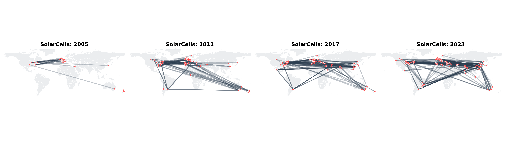
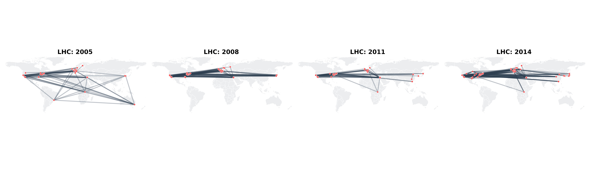

# publication-clusters
Melika Honarmand, Aude Maier, Edgar Desnos, Alexandre Carel

## Dataset

The primary dataset used in this project consists of scientific publications and their associated metadata retrieved from the OpenAlex API. It comprises over 480 million records and includes numerous features such as publication date, country of origin, authorship information, and citation links to other papers.

In terms of quality, the dataset is generally high, as it is derived from curated scholarly sources. While minor inconsistencies or missing values may exist, it is overall considered reliable and well-suited for the objectives of this project.

Several preprocessing steps were applied to prepare the data for analysis. These include data filtering based on topic and publication year, feature selection to retain only relevant variables, sampling to limit dataset size, and normalization through fractional weighting of relationships. Additionally, basic data cleaning was performed to handle missing or incomplete metadata. These steps ensure improved computational performance, consistency, and compatibility with subsequent modeling approaches.

A complementary dataset from the OpenStreetMap API is also incorporated. This dataset contains billions of geospatial entries, including coordinates, country information, and feature classifications. It is used to enrich the primary dataset through data augmentation, enabling more comprehensive spatial analysis.

## Problematic

This project focuses on visualizing the evolution of global academic influence by mapping citation networks between universities on a geospatial and temporal scale. While static rankings provide snapshots of institutional prestige, they fail to capture the **dynamic flow of knowledge** and how institutional interconnectedness shifts over decades. This visualization treats citations as directed geographic vectors that change in density and direction over time.

### Project Objectives
The visualization is designed to address three primary questions regarding the global research landscape:
1. **Temporal Connectivity:** Is the global academic network becoming more integrated over the years, or are we seeing the formation of isolated regional clusters?
2. **Shifting Hubs:** Which countries and cities have transitioned from "knowledge consumers" to "major exporters" of research between the 20th and 21st centuries?
3. **Citation Dyads:** Which specific pairs (university-to-university or country-to-country) have developed the strongest reciprocal links, and how do these alliances fluctuate?

### Motivation
The primary motivation is to move beyond static data to identify the **gravitational shift** of scientific impact. By implementing a longitudinal analysis, the project tracks the rise of new academic hubs (such as in East Asia or the Global South) relative to the historical dominance of North American and European institutions. It highlights:
1.  **Network Density:** The growth or contraction of citation lines across borders from year to year.
2.  **Leading/Lagging Regions:** A comparative look at which nations are the most (and least) cited globally and how those rankings change over time.
3.  **Institutional Loops:** Identifying "citation archipelagos", regions or university groups that primarily cite within their own network.

### Target Audience
This tool is intended for **bibliometric researchers, university strategists, and policy makers** who require a macro-level view of international research trends to inform funding, collaboration strategies, and geopolitical analysis of scientific output.

## Exploratory Data Analysis & Pre-processing

### The Approach
Our analysis uses the OpenAlex database to build a geographic network of research institutions for specific years. In these networks, nodes represent the universities or labs, and edges represent a citation link between them. To keep the data focused and reduce map clutter, we only draw edges between the institutions of the first authors of the papers. This allows us to map the primary "Lead Lab" responsible for the research. 

Our pre-processing pipeline followed three main steps:

1. **Topic Selection**: We fetch a fixed number of the top-cited papers per year for a specific topic. This ensures we are looking at the most influential work in the field and capturing the "core" of the scientific conversation.
2. **Coordinate Lookup**: Because many database entries are missing GPS data, we used OpenStreetMap (Nominatim) to manually map university names to their exact Latitude and Longitude. This step was crucial for ensuring every "Lead Lab" was accurately placed on the world map.
3. **Network Construction**: We build a "closed" graph for every year. This means we only visualize connections between the institutions that appear within our specific search results. This approach highlights the internal density of a field and shows how it becomes more or less "self-contained" over time.

---

### Domain Evolution: Case Studies

For this exploratory analysis, we selected two domains that demonstrate fundamentally different geographic behaviors: **Solar Cell Manufacturing** and **High-Energy Physics (LHC)**.

* **Solar Cells**: Shows a massive geographic shift. Research started in the US, Europe and Australia but became very China-centered in the last decade as the manufacturing industry migrated.

* **LHC**: Shows a fixed "anchor" model. Because the physical collider is in Switzerland, the network always contains a cluster in Europe, whereas the other hubs vary over time.

---

The geographic networks of research institutions and the above figures were generated using `main.py`.